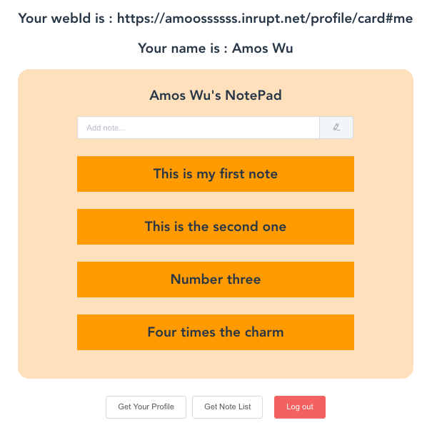

# Solid Example Vue



This is a [Solid](https://solidproject.org/) application example using [Vue.js](https://vuejs.org/). <br>
I recommend following the [developer tutorial](https://solidproject.org/for-developers/apps/first-app), when looking at this project.

Feel free to [contact me](mailto:amos70180@gmail.com) for more information.

## 💻 Prerequisites
You will need [Node.js](https://nodejs.org) version 6.0 or greater installed on your system.<br>
You will also need a Pod and webId to work with this example, [register here with inrupt](https://inrupt.net/).

## 🔧 Setup

Get the code by either cloning this repository using git

    > git clone https://github.com/amoossssss/solid_example_vue

... or [downloading source code](https://github.com/amoossssss/solid_example_vue/archive/master.zip) code as a zip archive.

Once downloaded, open the terminal in the project directory, and continue with:

```
npm install
```

### Compiles and hot-reloads for development
```
npm run serve
```
Now the website will be running on port 8080:
  >  http://localhost:8080

### Compiles and minifies for production
```
npm run build
```

### Lints and fixes files
```
npm run lint
```

## 📝 Why I made this example?

This is my first time learning and writing a [Solid](https://solidproject.org/) application. <br>
I feel frustrated when following the tutorial provided by Solid <br>
It is detailed and gets to the point, however most CodeSandBox examples cannot run on my machine. <br>
It also requires React and Redux background knowledge to understand the code their team provided. <br>

This example is written in [Vue.js](https://vuejs.org/), and I kept it as simple as possible. <br>
No [Vuex](https://vuex.vuejs.org/) and just a single component. <br>
That is said, everything is in the same page. <br>
I hope this will let developers from all levels understand the tutorial more easily.

## 🙏🏼 Credits

Most functions in this project are from the [Writing a Solid Application](https://solidproject.org/for-developers/apps) tutorial.

## ⭐️ Support this project

Please give a ***star*** if you find this project helpful. <br>
Any suggestions and improvements are highly appreciated!
